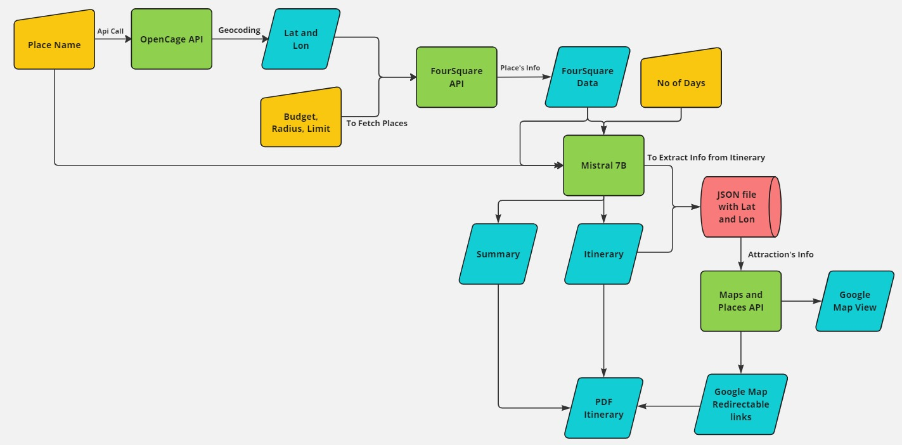

# Travel Itinerary Generator: Crafting Personalized Journeys beyond Imagination

**Travel Itinerary Generator** is a cutting-edge web application that leverages Generative AI to design personalized travel itineraries, perfectly suited to your preferences and budget. Traditional travel planning tools often fall short of providing the level of customization and real-time insights that modern travelers seek—**Travel Itinerary Generator** fills that gap, creating dynamic, AI-driven travel plans tailored just for you.

## Key Features

- **Timing Flexibility**  
  Users can adjust or customize the timing of their activities, ensuring that plans are adaptable to real-time changes (like traffic or delays).  

- **User-Friendly Input Interface**  
  With a focus on simplicity and clarity, Travel Itinerary Generator makes the process of providing travel details intuitive, enhancing the overall user experience.  

- **Hotel Recommendations**  
  Receive tailored accommodation suggestions that align with your budget and proximity to planned activities, ensuring a comfortable and convenient stay.  

- **Activity Suggestions with Delay Considerations**  
  Travel Itinerary Generator offers alternative activity suggestions or adjusts timings if delays are expected, keeping travel plans smooth and flexible, even with unforeseen changes.  

- **Pricing Range for Activities**  
  See pricing ranges for suggested activities, allowing users to select options that fit their budget while maximizing their travel experience.  

- **Map Integration**  
  Dynamic maps visualize your planned itinerary, hotels, and activities for easier navigation and a comprehensive view of your travel experience.  

## How It Works

### Input
Users provide essential travel details such as destination, budget, and preferences. Travel Itinerary Generator utilizes this information, alongside real-time data, to craft a personalized travel itinerary.

### Home Page
Your journey with Travel Itinerary Generator starts on the welcoming home page, designed to lead you seamlessly through the input process for a customized experience.

### Modal Input Example
Travel Itinerary Generator provides simple and clear modals for entering preferences, ensuring an intuitive and user-friendly setup.

### Top Destinations
Explore popular destinations as well as hidden gems curated by Travel Itinerary Generator to spark inspiration for your next adventure.

### Flowchart
Here is a flowchart illustrating the process behind Travel Itinerary Generator's personalized itinerary generation:  


## Usage

To get started with **Travel Itinerary Generator**:

1. **Clone the repository**:
   ```bash
   git clone https://github.com/yourusername/Cerebro-X_Travel-Itinerary-Generator_oneAPI_hack_kpr.git
   ```
2. **Navigate to the project directory**:
   ```bash
   cd travel-itinerary-generator
   ```
3. **Install dependencies**:
   ```bash
   pip install -r requirements.txt
   ```
4. **Run the application (Django)**:
   ```bash
   python manage.py runserver
   ```

## Technologies Used

### Backend
- **Django**: The core framework powering the backend of the application.

### Frontend
- **HTML, CSS, JavaScript**: For a responsive, dynamic, and visually appealing user interface.

### AI & Language Models
- **Hugging Face**: Hugging Face Transformers Library enables natural language generation for crafting personalized itineraries.

### APIs
- **Foursquare**: Provides data on local venues and activities.
- **OpenCage**: Geocoding service for accurate location data.
- **OpenWeather**: Delivers up-to-date weather data to assist with activity planning.
- **Google Maps**: Ensures dynamic navigation and map visualization for users.

## Output

Once the personalized itinerary is complete, users receive a beautifully crafted, detailed PDF that outlines their travel plans in an easy-to-read and visually pleasing format. Here are examples of what the output might look like:

  
  
  
